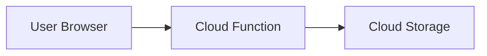

# SnapShare
SnapShare is a simple cloud application that allows unauthenticated event attendees to upload photos for the host to see. This project leverages Google Cloud services, including Cloud Functions, Cloud Storage, and Terraform for infrastructure management.

## Table of Contents
- Architecture
- Setup
- Testing
- Usage
- Important Information

## Architecture
The architecture of SnapShare consists of the following components:

1. Frontend: A simple HTML page for uploading photos.
2. Backend: A Google Cloud Function that generates signed URLs for uploading photos to Google Cloud Storage.
3. Infrastructure: Managed using Terraform, which provisions the necessary Google Cloud resources.



## Setup

Prerequisites
- Google Cloud account
- Terraform 1.10.x
- Python 3.10 

### Steps

1. Set up Google Cloud:
 - Create a new project and set the project ID in `terraform/vars/dev.tfvars`
2. Prepare the function code
```sh
./prep-function.sh
```
3. Apply the Infrastructure
 - Update `terraform/vars/` with your project details and domain name.
 - Initialize and apply Terraform configuration
```sh
cd terraform
terraform init
terraform apply -var-file=vars/dev.tfvars
```
4. Upload the static site files
```sh
./upload_website.sh
```

